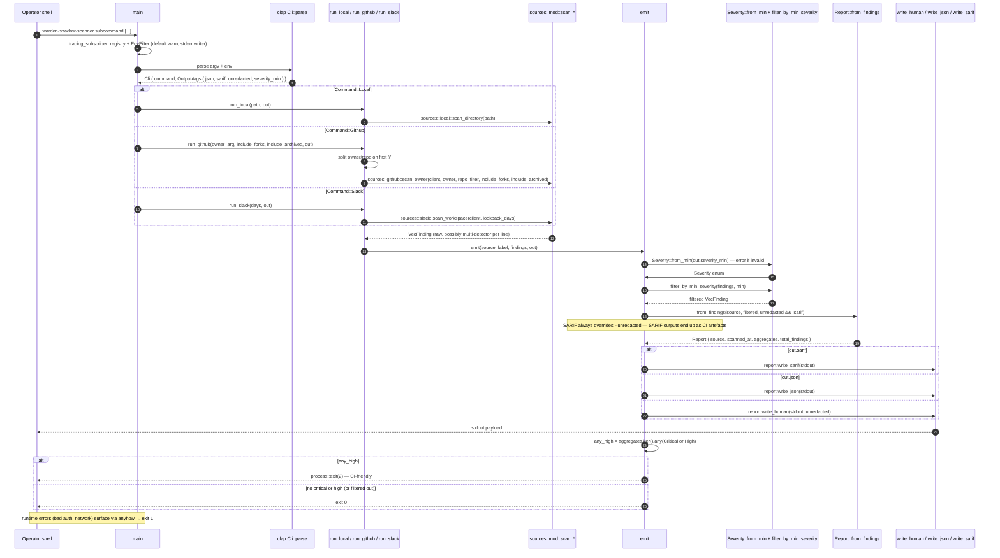
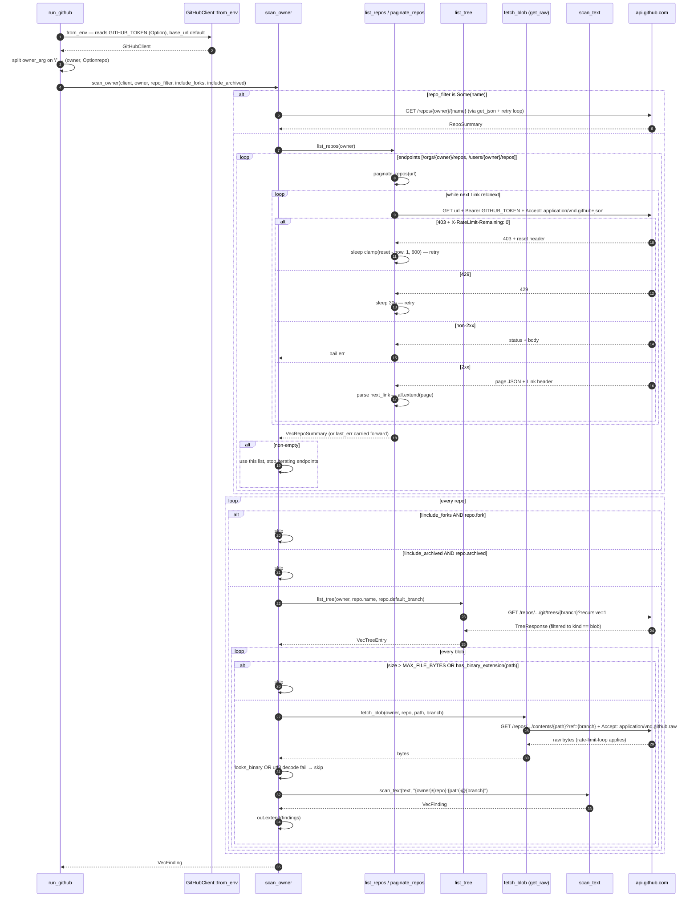
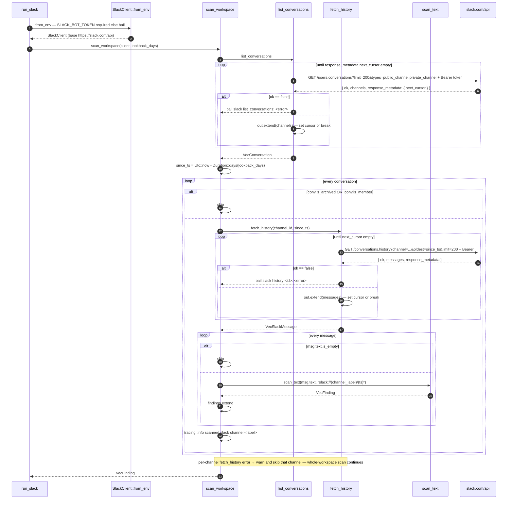
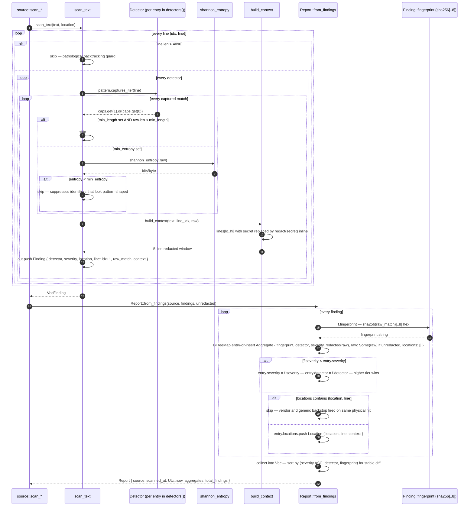
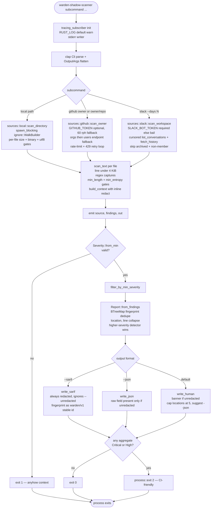

# warden-shadow-scanner sequence diagrams

Five sequence diagrams covering the wire-level paths the scanner can
take: CLI dispatch + the shared `emit` pipeline, the gitignore-aware
local-filesystem scan, the GitHub org / repo scan with rate-limit
backoff, the Slack workspace scan, and the per-line detector engine
that turns matched bytes into a deduped `Report`. A flowchart at the
end captures the request decision tree (source × output × severity
filter × exit code).

The scanner is a single CLI binary, so the diagrams highlight the
boundaries it crosses: the local filesystem (via the `ignore` crate),
`api.github.com` (REST + ETag-free polling), `slack.com/api`
(cursored history), and stdout (human / JSON / SARIF).

## 1. CLI dispatch + the shared `emit` pipeline

`main` reads as a sequential pipeline: tracing init (default `warn`)
→ clap `Cli::parse` → dispatch to one of three async runners → each
calls `emit(source, findings, OutputArgs)` to filter, group, and
format → exit 0/2 by `any_high` aggregation. `OutputArgs` is
`#[command(flatten)]`-ed onto every subcommand so the surface is
identical across `local`, `github`, and `slack`.

## 2. `local` — gitignore-aware filesystem walk

`scan_directory` pushes the synchronous `ignore::WalkBuilder` walk
onto the blocking pool, collects every candidate path into a Vec,
then reads + scans each file asynchronously. Per-file the metadata
size cap, the NUL-byte binary heuristic, and the UTF-8 check all
short-circuit before any regex work. Individual file failures
`warn`-log and continue — one unreadable file never wedges an
org-wide scan.

```mermaid
sequenceDiagram
    autonumber
    participant Run as run_local
    participant Scan as scan_directory
    participant Gather as gather_paths (spawn_blocking)
    participant Ignore as ignore::WalkBuilder
    participant Tokio as tokio::fs
    participant Det as scan_text

    Run->>Scan: scan_directory(root: &Path)
    Scan->>Gather: tokio::task::spawn_blocking gather_paths(root.clone)
    activate Gather
    Gather->>Ignore: WalkBuilder::new(root).standard_filters(true).hidden(false).build
    Note over Ignore: .gitignore-aware,<br/>still descends into dotfiles like .env
    loop walker entries
        Ignore-->>Gather: DirEntry or error
        alt walk error
            Gather->>Gather: tracing::warn — walk error — continue
        else file_type == file
            Gather->>Gather: out.push(path.to_path_buf)
        else dir / symlink / other
            Gather->>Gather: skip
        end
    end
    Gather-->>Scan: VecPathBuf
    deactivate Gather
    loop every collected path
        Scan->>Scan: scan_one_file(path)
        Scan->>Tokio: metadata(path)
        alt metadata err
            Tokio-->>Scan: Err
            Scan->>Scan: tracing::warn skip path — continue
        else size > MAX_FILE_BYTES
            Tokio-->>Scan: metadata.len() > MAX_FILE_BYTES
            Scan->>Scan: tracing::debug skip oversized — return Vec::new
        end
        Scan->>Tokio: read(path)
        Tokio-->>Scan: bytes
        Scan->>Scan: looks_binary (NUL-byte heuristic, same as git uses)
        alt binary
            Scan->>Scan: tracing::debug skip binary — return Vec::new
        end
        Scan->>Scan: std::str::from_utf8(&bytes) — not UTF-8 → return Vec::new
        Scan->>Det: scan_text(text, path.display.to_string)
        Det-->>Scan: VecFinding
        Scan->>Scan: findings.append(&mut fs)
    end
    Scan-->>Run: VecFinding
```

## 3. `github` — owner-or-repo scan with rate-limit backoff

`GitHubClient::from_env` pulls an optional `GITHUB_TOKEN` (unset
falls back to the 60-req/hour public ceiling). `scan_owner` either
fetches one named repo or paginates `/orgs/{owner}/repos` →
`/users/{owner}/repos` (whichever returns non-empty wins; both
errors bubble up with context). Every HTTP call goes through a
retry-on-rate-limit loop that respects `X-RateLimit-Reset` and
sleeps on 429 with a 30s backoff.

## 4. `slack` — workspace scan with cursor-paginated history

`SlackClient::from_env` requires `SLACK_BOT_TOKEN` (errors out at
boot if unset — required scopes documented in
`src/sources/slack.rs`). `scan_workspace` lists every conversation
the bot is a member of (cursor-paginated), skips archived /
non-member rooms, then pages `conversations.history` for each
remaining channel back to `now - lookback_days`. Slack returns
`{ ok: false, error }` with a 200 status, so every paged response is
parsed and the `ok` flag inspected before consuming `messages`.

## 5. Detector engine — `scan_text` + `Report::from_findings`

The detector engine is shared by all three sources. For every line
under 4 KiB (pathological-regex guard), every detector's regex runs;
matches that clear `min_length` and `min_entropy` (Shannon, bits per
byte) produce a `Finding` with a ±2-line redacted context window.
`Report::from_findings` then groups by SHA-256 fingerprint of the
raw secret (so the same key in 12 files becomes one entry with 12
locations), dedupes inside an aggregate by `(location, line)` to
collapse the vendor-vs-generic-backstop overlap, and keeps the
highest-severity detector name on conflict.

## 6. Request decision tree (flowchart)

A single CLI invocation fans out across four orthogonal knobs: the
source subcommand, the output format, the redaction posture, and
the severity-min cutoff. The exit code then comes from whether any
surviving aggregate is Critical or High.

